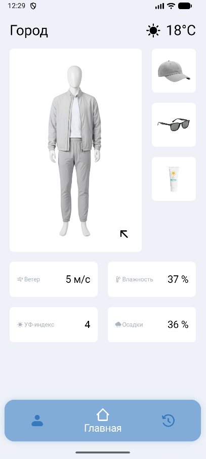

# WeatherFit

WhetherFit is a simple android application that will help you choose clothes based on the weather conditions.

WeatherFit will help you if you don't understand how to dress when looking at the weather, and when you look at people on the street, you become even more confused, as some are wearing T-shirts and others jackets.

## Features

<table border="0" cellpadding="0" cellspacing="0" rules="none" frame="void">
  <tr>
    <td valign="top" align="center" border="0">
      <b>Fit suggestion</b>
        
      
    </td>
    <td valign="top" align="center" border="0">
      <b>Change settings</b>
        
      
    </td>
    <td valign="top" align="center" border="0">
      <b>Feedback</b>
        
      
    </td>
  </tr>
</table>

## Download

To start using the app, you need to <a href="https://github.com/KyDblM/WeatherFit/releases/download/v1.0.0/app-release.apk">download the APK</a> and perform the initial setup.

  <b>Initial setup</b>
   
   
  

